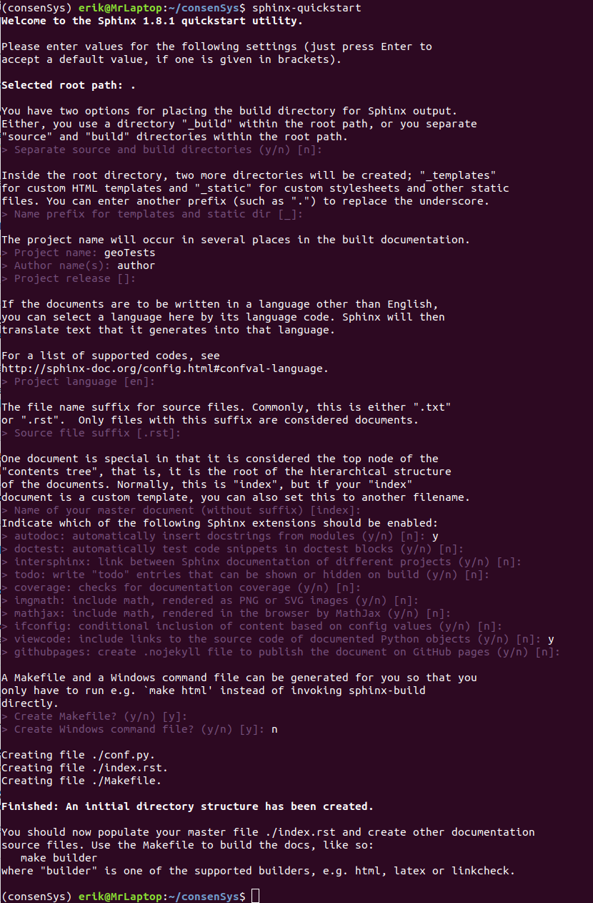

# Google Geolocation Test Suite

## About

This suite is a series of tests run using the pytest framework to exercise the Google API Geolocation API. The functional tests are mainly executed via the requests library with a small performance suite demonstration run via jMeter.

The tests require a Google API key. Navigate to the [Google Maps Platform](https://developers.google.com/places/web-service/get-api-key), scroll down and click the button that says "Get A Key" and follow the instructions to acquire a key. The Geocoding API must also be enabled from the developers console.

## Setup

### Prerequisites

This suite and the setup described were created and executed on Ubuntu 18.04 and the project uses Python 3.6.
The latest installation of jMeter is also required.

Install venv (if not already installed)

`sudo apt-get install python3-venv`

Setup a virtual environment to run the project in

`python3 -m venv {folderName}`

cd to the the new folder name and activate the virtual environment

`. bin/activate`

Install the required packages

`pip install -r requirements.txt`

A few configuration changes need to be made before running.

* Edit the conftest.py file and change the parameter set to "API_KEY" to your actual API KEY

* Edit the geo_perf_test.jmx file, search for "API_KEY" and replace it with your actual API KEY

* Edit the run.sh file, change the path to the folder where your jmeter installation is

<pre>
export PATH="$PATH":<b>/home/erik/jmeter/bin</b>
</pre>


### Sphinx configuration 

The project uses Sphinx to generate test case summary documentation. The tests are summarized at the bottom of this document but to auto generate it from docstrings, follow the steps below

From the command line, type `sphinx-quickstart`

Answer all the questions as below



Modify the conf.py file and uncomment the three lines below setup as shown below

```
# -- Path setup --------------------------------------------------------------

# If extensions (or modules to document with autodoc) are in another directory,
# add these directories to sys.path here. If the directory is relative to the
# documentation root, use os.path.abspath to make it absolute, like shown here.
#
import os
import sys
sys.path.insert(0, os.path.abspath('.'))
```
Remove the index.rst file that is created by default and rename the index_original.rst to index.rst

From the command line

`make html`

## Execution

In the root folder, execute the run script
`run.sh`

A folder will be created with the current time stamp that outputs the results from the tests


## Test Summary

### Functional
The API is exercised using the following options

1. Specific address (street number, city, state, zip code, country)
2. Place name and country
3. Country only
4. Address and optional region parameter
5. Address and optional language parameter
6. Address and optional component parameter
7. Components only
8. Ambiguous search term resulting in multiple results returned
9. Narrow search results using the optional bounds parameter
10. Reverse geocoding using latlng
11. Reverse geocoding using one optional result_type parameter
12. Reverse geocoding using multiple result_type parameters
13. Reverse geocoding using location_type parameter
14: Reverse geocoding using multiple location_type parameters
15: Reverse geocoding using place id
    
Negative tests are also included
* Invalid HTTP method - POST
* Invalid HTTP method - DELETE
* URL longer than maximum allowed
* Invalid API key
* No API key parameter
* No address parameter
* Non-existent address
* Invalid region
* Invalid language
* Invalid components
* Reverse geocoding with no latlng parameter
* Reverse geocoding with invalid result_type
* Reverse geocoding with invalid latlng values
* Reverse geocoding with invalid place_id
* Reverse geocoding with invalid location_type
* Invalid bounds

### Performance

The jMeter script has three threads with each execute a query and validate both that the response was successful and that the formatted address for each request is correct. By default, the settings are set for 1 user and 1 loop because the test is mainly for demonstration purposes. In a real test scenario, these would be modified to be more realistic.
